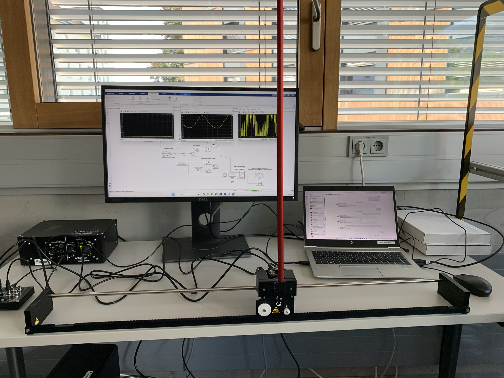

# Project: Linear Pendulum Gantry
Thomas Lønne Stiansen

Project for the following courses at Fachhochschule Vorarlberg (FHV):
- Applied Robotics - only graded for this course
- Control Engineering

*Supervised by Stefan Bonerz.*

## Project Division

The project is organized into the following sub-goals:

- **Guide:** Operation guide for later students, including test with reading and writing signals
- **Cart Position:** Differential equation(s) for cart $\rightarrow$ Transfer function $G_{cart}(s) = \frac{X(s)}{V(s)}$ $\rightarrow$ Linear Position Control ($x$)

## Directories

*(that are not self explanatory)*

- Archiv = Project folder given by Stefan Bonerz