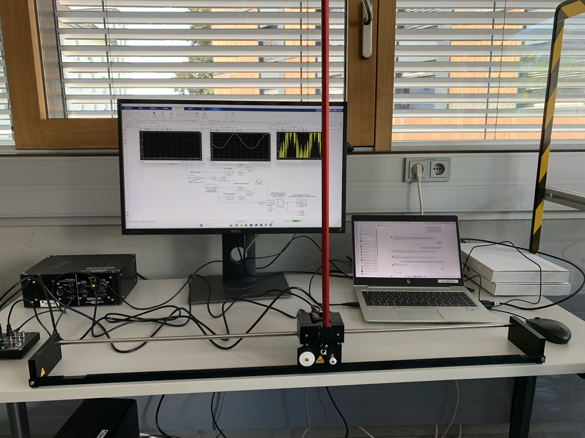

# Project: Linear Pendulum Gantry
Thomas Lønne Stiansen

Project for the following courses at Fachhochschule Vorarlberg (FHV):
- Applied Robotics - only graded for this course
- Control Engineering

*Supervised by Stefan Bonerz and Robert Amann, and help by Markus Seeberger*

## Project Division

The project is organized into the following sub-goals:

- **Guide:** Operation guide for later students, including test with reading and writing signals
- **Cart Position:** Differential equation(s) for cart $\rightarrow$ Transfer function $G_{cart}(s) = \frac{X(s)}{V(s)}$ $\rightarrow$ Linear Position Control ($x$)
- **State-Space Control:** Design state-space controller with LQR

## Directories

*(that are not self explanatory)*

- Archiv = Project folder given by Stefan Bonerz
- Supplements = Files given throughout the project. Most important ones:
    - QUARC_Setup_English.pdf - Given by Markus Seeberger & expanded during R&D
    - Lösung_11.pdf - Presentation from BSc course provided by Stefan Bonerz

## Demo
A small demo video is given in the root folder under: "SIP.mov"